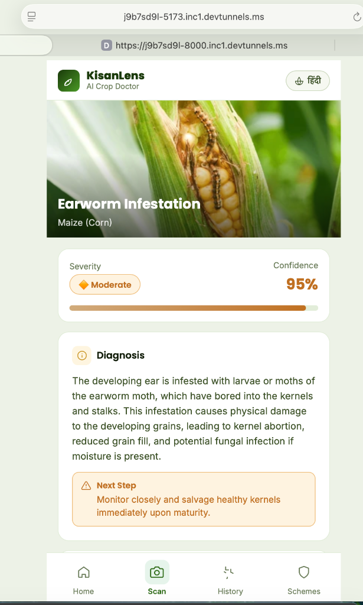
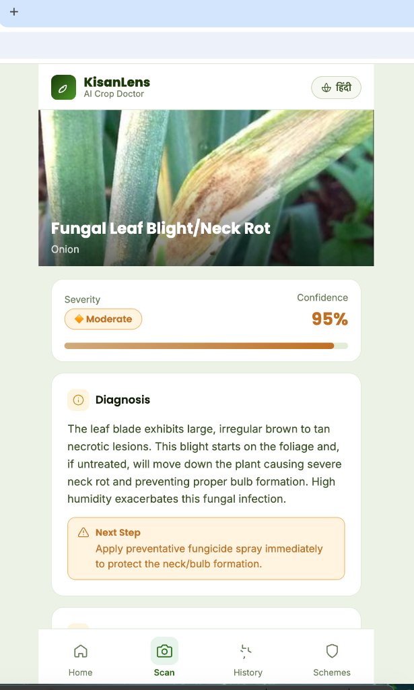
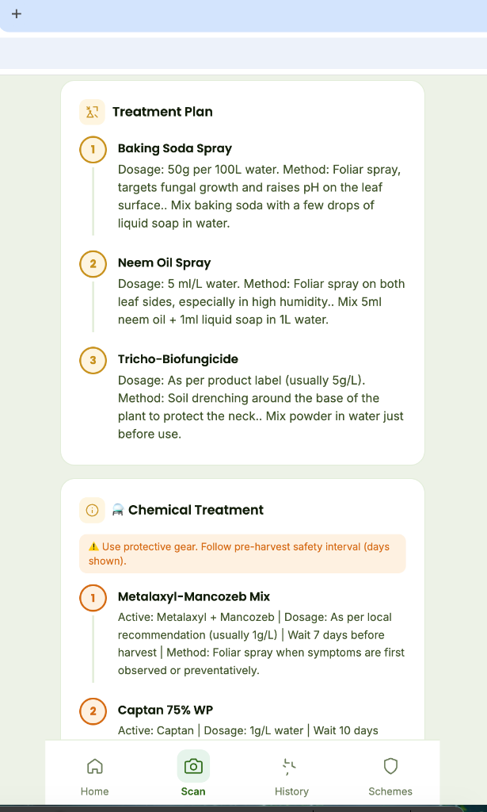

# 🌾 KisanLens — AI Crop Disease Analyser

**KisanLens** is an AI-powered crop disease analysis and treatment recommendation system built for Indian farmers. It uses Google Gemma 4 running locally via LM Studio — no cloud, no internet, 100% private.

---

## ⏱️ Important — Response Time

> **Each analysis request takes approximately 150–160 seconds to complete.**
>
> This is expected behaviour. The model (Gemma 4 E4B) reasons deeply about the crop image before generating a diagnosis. During this time, the app shows live progress updates every 5 seconds — the screen is **not frozen**, it is actively processing.
>
> Do **not** close the app or refresh the page while the analysis is running.

---

## 🔗 URLs

| Service | Local URL | Network URL (DevTunnel) |
|---------|-----------|--------------------------|
| **Frontend (KisanLens App)** | http://localhost:5173 | https://j9b7sd9l-5173.inc1.devtunnels.ms |
| **Backend API** | http://localhost:8000 | https://j9b7sd9l-8000.inc1.devtunnels.ms |
| **API Docs (Swagger)** | http://localhost:8000/docs | https://j9b7sd9l-8000.inc1.devtunnels.ms/docs |
| **Server Status** | http://localhost:8000/status | https://j9b7sd9l-8000.inc1.devtunnels.ms/status |
| **Health Check** | http://localhost:8000/health | https://j9b7sd9l-8000.inc1.devtunnels.ms/health |

> **Note:** DevTunnel URLs change each session. Update them in VS Code → Ports tab after each restart.

---

## 📱 Application Screenshots

Here is a preview of the KisanLens mobile-responsive interface showing disease detection and detailed treatment plans:

| 1. Diagnosis (Maize) | 2. Diagnosis (Onion) | 3. Detailed Treatment Plan |
|---|---|---|
|  |  |  |

---

## 🛠️ Tech Stack

| Component | Technology |
|-----------|-----------|
| **AI Model** | Google Gemma 4 E4B (`google/gemma-4-e4b`) |
| **Inference Engine** | LM Studio (localhost:1234) |
| **Backend** | FastAPI + Python 3.14 |
| **Frontend** | React + Vite |
| **Streaming** | Server-Sent Events (SSE) — devtunnel-safe |
| **Concurrency** | Up to 5 simultaneous requests |

---

## 🚀 Starting the Servers

### 1. Start LM Studio
- Open LM Studio
- Load model: `google/gemma-4-e4b`
- Start the local server on **port 1234**

### 2. Start the Backend
```bash
cd "/Users/pratik/Downloads/gemma 4/files"
source .venv/bin/activate
python main.py
```
Backend runs on: **http://localhost:8000**

### 3. Start the Frontend
```bash
cd "/Users/pratik/Downloads/gemma 4/frontend"
npm run dev
```
Frontend runs on: **http://localhost:5173**

---

## 📂 Project Structure

```
gemma 4/
├── KisanLens.jsx          # Main React component (source of truth)
├── README.md              # This file
│
├── files/                 # Backend
│   ├── main.py            # FastAPI app v4.2 (SSE streaming)
│   ├── requirements.txt   # Python dependencies
│   └── .venv/             # Python virtual environment
│
└── frontend/              # React + Vite app
    ├── src/
    │   └── App.jsx        # ← Synced from KisanLens.jsx
    ├── package.json
    └── vite.config.js
```

> **Important:** Always edit `KisanLens.jsx` (root), then copy to `frontend/src/App.jsx`.  
> Never edit `App.jsx` directly.

---

## 📡 API Endpoints

| Endpoint | Method | Description |
|----------|--------|-------------|
| `/` | GET | Service info and version |
| `/status` | GET | Active requests, available slots |
| `/health` | GET | LM Studio connectivity check |
| `/analyze-crop` | POST | **Main** — analyse a crop image (SSE stream) |
| `/docs` | GET | Swagger interactive API docs |

### How `/analyze-crop` Works (SSE Streaming)

The endpoint uses **Server-Sent Events** to stream progress back to the client:

```
POST /analyze-crop  (multipart/form-data, field: "file")
↓
← text/event-stream
  data: {"type":"status", "message":"🔍 Analysing crop symptoms… (10s)"}   ← every 5s
  data: {"type":"status", "message":"🧠 Building diagnosis… (65s)"}
  ...
  data: {"type":"result", "data":{ ...full JSON diagnosis... }}
```

This keeps the connection alive through DevTunnel, which would otherwise time out after 60 seconds.

---

## 🌿 What KisanLens Analyses

Each response includes:

- **Crop type** identified from the image
- **Disease name** and scientific name
- **Confidence score** (0–100%)
- **Severity level** (Mild / Moderate / Severe)
- **Urgency** recommendation
- **Organic treatments** (ranked, with dosage and method)
- **Chemical treatments** (with active ingredient and safety interval)
- **Prevention strategies**
- **Government schemes** (PM-KISAN, PMFBY, Kisan Credit Card)
- **Immediate actions** the farmer should take

---

## ⚙️ Backend Configuration (`main.py`)

| Setting | Value |
|---------|-------|
| `LM_STUDIO_URL` | `http://localhost:1234` |
| `MODEL_NAME` | `google/gemma-4-e4b` |
| `MAX_TOKENS` | `4000` |
| `TEMPERATURE` | `0.2` |
| `TIMEOUT_SECONDS` | `600` |
| `MAX_CONCURRENT` | `5` requests |
| `IMAGE_MAX_PX` | `1024` px (longest side) |

---

## 🔍 Troubleshooting

| Symptom | Cause | Fix |
|---------|-------|-----|
| App shows "Analysing…" for 150–160s | Normal — model reasoning | Wait, do not refresh |
| `Analysis failed` error | LM Studio not running | Open LM Studio, load model, start server |
| Backend port 8000 not responding | Backend not started | Run `python main.py` in `/files` |
| Remote devices can't connect | DevTunnel port not forwarded | In VS Code → Ports → forward **both** 5173 and 8000 |
| "Server at capacity" message | 5 requests already running | Wait ~2 minutes, then retry |
| Response time > 180s | LM Studio under heavy load | Reduce concurrent users or restart LM Studio |

---

## 📈 Performance Notes

- **Single request**: ~150–160 seconds
- **4 concurrent requests**: all finish within ~165 seconds (LM Studio handles parallelism via prompt cache)
- **Prompt cache efficiency**: increases with concurrent requests (up to ~45% cache hit rate observed)
- **Memory**: LM Studio uses ~4–6 GB VRAM for this model
- **CPU fallback**: If no GPU, expect 5–10× slower inference

---

## 🔒 Security Notes

- All inference is **local** — no data leaves the machine
- CORS is currently open (`*`) — restrict to your domain before public deployment
- No authentication required (suitable for local/LAN use)
- DevTunnel exposes the app publicly — disable when not in use

---

**Version**: 4.2 (SSE Streaming)  
**Last Updated**: June 2025  
**Model**: Google Gemma 4 E4B via LM Studio  
**Backend**: FastAPI + SSE (no Ollama, no Docker required)
